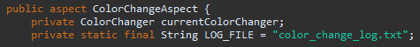
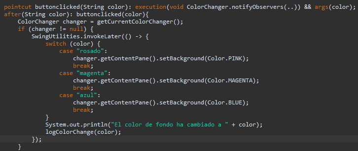
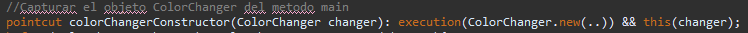
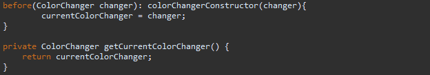
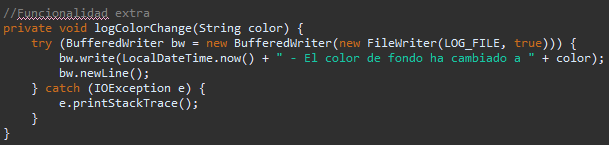
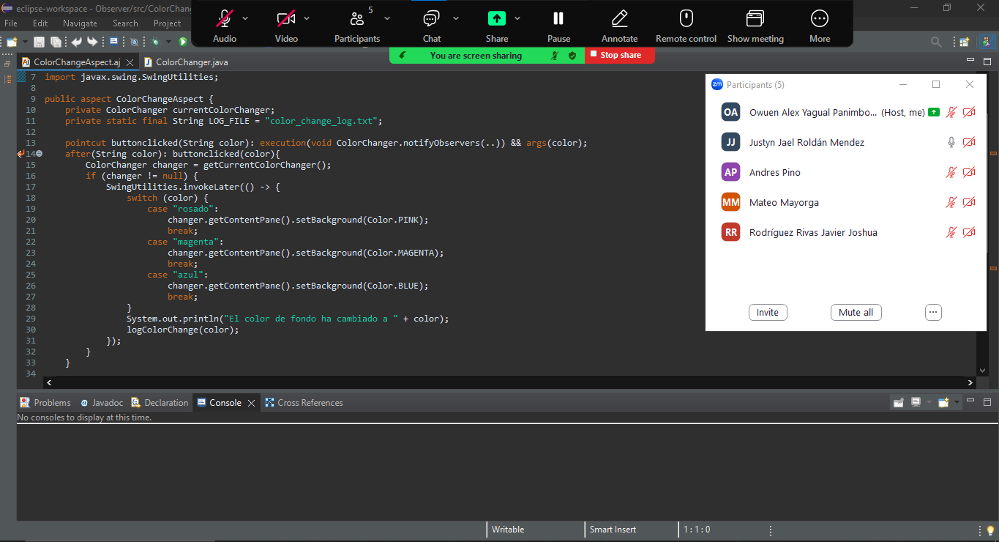

# Tarea01-Aspectos
# Proyecto de Cambio de Color de Fondo

Este proyecto es una aplicación Java Swing que cambia el color de fondo de una ventana al hacer clic en diferentes botones. Los botones disponibles son "Rosado", "Magenta" y "Azul".

## Funcionalidades

- **Cambio de Color de Fondo:** Cada botón cambia el color de fondo de la ventana al color correspondiente y muestra un mensaje en la consola indicando el cambio.
- **Registro de Cambios de Color:** Se utiliza AspectJ para implementar la funcionalidad de logging. Cada vez que se cambia el color de fondo, se registra un mensaje en la consola antes de que el color cambie, utilizando aspectos para separar esta preocupación transversal del núcleo de la lógica de cambio de color.
- **Registro en Archivo de Texto:** Además de mostrar el mensaje en la consola, los cambios de color también se registran en un archivo de texto llamado `color_change_log.txt` junto con la fecha del cambio. Cada vez que se ejecuta el programa, una linea vacia separa un registro de ejecución de otro.

### Herramientas Utilizadas

- JDK 21
- Eclipse con AspectJ Development Tools (AJDT)

### Ejecución

1. Clonar el repositorio.
2. Importar el proyecto en Eclipse.
3. Ejecutar la clase `ColorChanger` para iniciar la aplicación.

## Funcionalidades 
**1)**

  **currentColorChanger:** Un atributo que guarda la referencia a la instancia actual de ColorChanger.
  
  **LOG_FILE:** Una constante que define el nombre del archivo de log donde se registran los cambios de color.

**2)**

- **Poincut buttonclicked:** Se define un pointcut que captura la ejecución del método notifyObservers de la clase ColorChanger y pasa el argumento color a los consejos (advice).

- Este advice after se ejecuta después de que **notifyObservers** es llamado. Obtiene la instancia actual de ColorChanger.
 Si la instancia es válida, usa **SwingUtilities.invokeLater** para cambiar el color de fondo de la ventana en el hilo de despacho de eventos de Swing. Imprime un mensaje en la consola indicando el cambio de color.

- Llama al método **logColorChange()** para registrar el cambio de color en un archivo de log.

**3)**

- **Pointcut colorChangerConstructor:** Se Define un pointcut que captura la creación de una nueva instancia de ColorChanger.

**4)**

**- Advice before:**
- Este advice se ejecuta antes de que el constructor de ColorChanger sea ejecutado.
- Asigna la instancia creada de ColorChanger al atributo currentColorChanger.
  
**- Método getCurrentColorChanger:**
- Método auxiliar que devuelve la instancia actual de ColorChanger.

  

## Funcionalidad extra (Aspectos) | **Separación de requerimientos (core y cross cutting concerns)**

**Cross cutting concerns:**

Estos son requisitos que afectan a múltiples partes de la aplicación pero no están centralizados en una sola funcionalidad principal.
Un ejemplo de estos concerns se ve en el método realizado como funcionalidad extra:

**Método logColorChange()** utilizado en un advice anterior que:

- Registra el cambio de color en un archivo de log con la marca de tiempo actual.
  
- Usa BufferedWriter para escribir en el archivo de manera eficiente.
  
- Maneja posibles excepciones de E/S (Input/Output).

La lógica del logging del reporte y la actualización del color de fondo se manejan en el aspecto, lo que significa que no se mezclan con la lógica principal de la clase ColorChanger.
Esto reduce el acoplamiento entre las funcionalidades principales y las transversales, facilitando cambios y mantenimiento.

## Evidencia Trabajo Colaborativo

